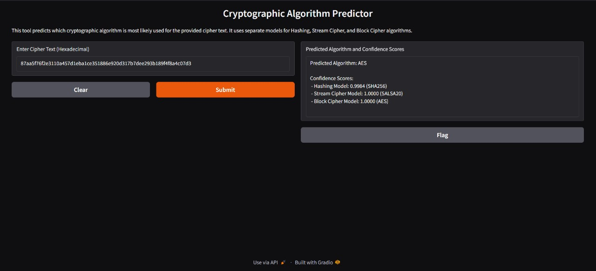
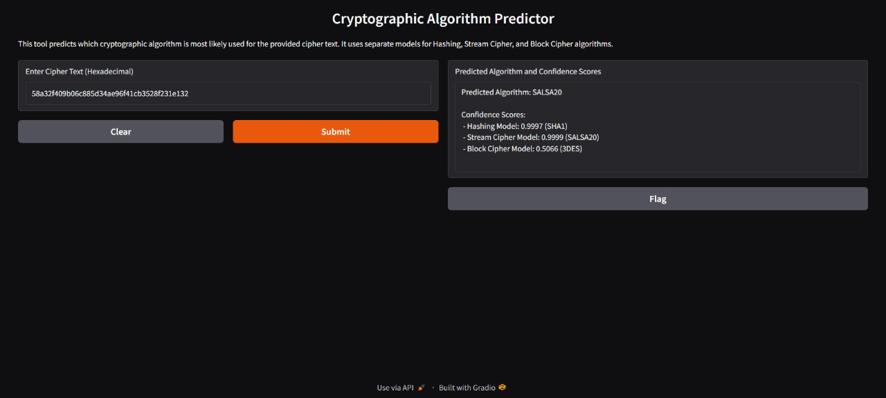

# Encryption Algorithm Detector

### Identification of Cryptographic Algorithm using AI/ML Techniques (SIH 2024 Problem Statement - 1681)
This repository implements an AI/ML-based solution for identifying cryptographic algorithms from given datasets. 

---

### Background
With a vast number of cryptographic algorithms available, ensuring data confidentiality and integrity in secure communication is critical. Identifying the algorithm used in cryptographic operations is a research activity aimed at uncovering weaknesses in algorithm implementation, leading to more robust and secure systems.

### Objective
This project aims to develop an AI/ML-based approach to identify cryptographic algorithms by analyzing given datasets. The proposed solution combines innovative machine learning techniques and logical analysis to determine the algorithm used for encryption or hashing.

### Our Solution
- Development of logical and innovative AI/ML approaches for algorithm identification.
- Implementation in software form, capable of taking a dataset as input and providing the probable cryptographic algorithm as output.

---

## Preview of how the front-end interface looks:





---


## Project Overview

This project focuses on identifying three major types of cryptographic techniques: **Block Ciphers**, **Stream Ciphers**, and **Hashing Algorithms**. 

### Block Ciphers
Block ciphers encrypt data in fixed-sized blocks (e.g., 64-bit or 128-bit blocks). Popular examples include AES, DES, and 3DES. These algorithms often operate in modes such as:
- **ECB (Electronic Codebook)**: Encrypts each block independently, which can lead to patterns in ciphertext.
- **CBC (Cipher Block Chaining)**: Uses an initialization vector (IV) and chains blocks together, making it more secure than ECB.

### Stream Ciphers
Stream ciphers encrypt data one bit or byte at a time, making them faster and more suitable for streaming applications. Examples include RC4 and Salsa20. Stream ciphers are lightweight and effective for encrypting data in real-time scenarios.

### Hashing Algorithms
Hashing algorithms generate a fixed-size hash value from input data, ensuring data integrity. Unlike encryption, hashing is a one-way process. Common algorithms include SHA-256, MD5, and SHA-1. These are widely used in digital signatures, password storage, and data integrity checks.

---

## Folder Structure

```plaintext
encryption-algorithm-detection/
├── Training_code/
│   ├── Hash_train.ipynb           
│   ├── Block_train.ipynb          
│   └── Stream_train.ipynb         
├── Testing_code.ipynb             
├── front.ipynb                   
├── models/
│   ├── block/
│   │   └── block_algorithm_cnn_model.h5       
│   ├── stream/
│   │   └── stream_algorithm_cnn_model.h5     
│   └── hash/
│       └── hashing_algorithm_cnn_model.h5     
├── Datasets/
│   ├── block_cipher_algorithms_dataset_colab.csv
│   ├── hashing_algorithms_dataset_colab.csv     
│   └── stream_algorithms_dataset.csv             
└── README.md
```


## How to Use
### Clone the Repository
```bash
git clone https://github.com/j4ik2i5x0/encryption-algorithm-detection.git
cd encryption-algorithm-detection
```

### Run Training
1. Open the relevant training notebook from the `training/` folder.
2. Load the corresponding dataset from `datasets/`.
3. Train the model and save the output in the `models/` folder.

### Test Models
1. Open `Testing_code.ipynb`.
2. Load a pre-trained model from the `models/` folder.
3. Provide a dataset or individual samples to evaluate the model's performance.

### Front-End Interaction
1. Open `front.ipynb`.
2. Input the ciphertext or data to predict the encryption algorithm.
   
#### The front-end of this project is built using Gradio, a Python library that helps create interactive user interfaces for machine learning models. This allows users to easily input ciphertext and receive predictions on which encryption algorithm was used, making the process user-friendly and intuitive.
---

## Technologies Used
- **AI/ML Framework**: TensorFlow
- **Programming Language**: Python
- **Libraries**: NumPy, Pandas, Matplotlib, Scikit-learn, Gradio


---

## Prerequisites
Install dependencies using:
```bash
pip install tensorflow numpy pandas matplotlib scikit-learn gradio
```

## Contribution Guidelines
Contributions are welcome! If you find a bug or have an idea for improvement, please submit an issue or a pull request.

## License
This project is licensed under the MIT License. See the `LICENSE` file for details.

## Acknowledgments
This project is developed in alignment with the problem statement provided by **National Technical Research Organisation (NTRO)**. Special thanks to the open-source community for the tools and libraries that made this possible.

A special thanks to my team, **Cipher_crew**, for their hard work and dedication to this project.


